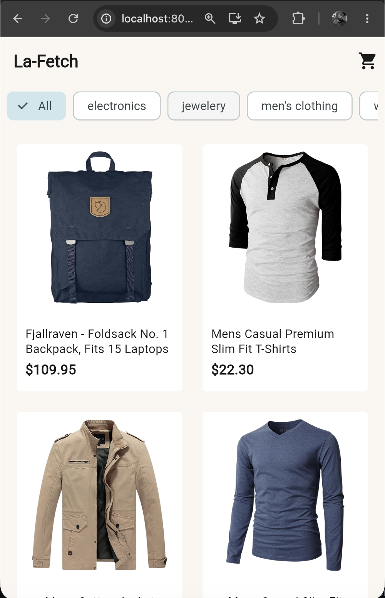
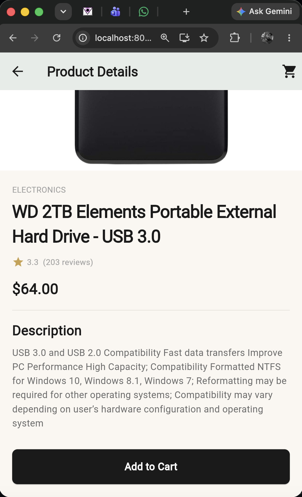
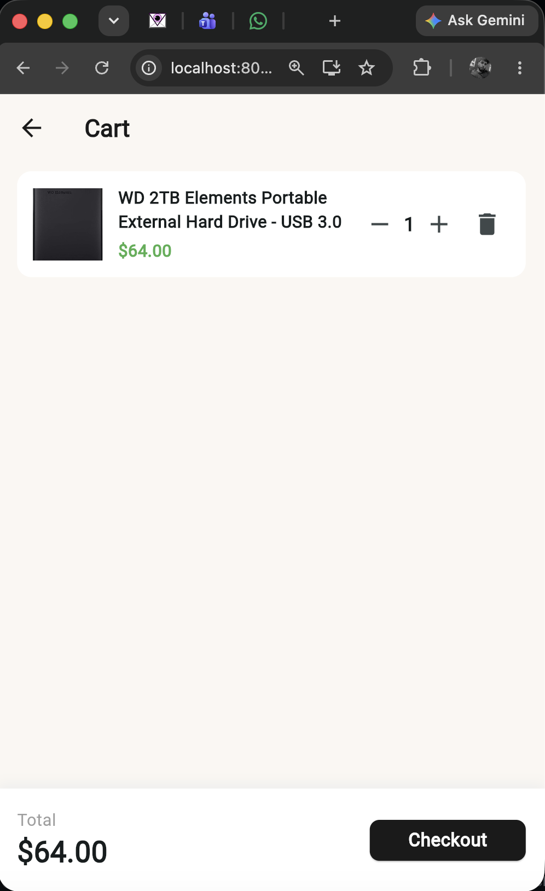

# La-Fetch Mini Marketplace

A Flutter e-commerce marketplace app built with Clean Architecture and MVVM, using the Fake Store API to display products, filter by category, and manage a local shopping cart.

**Tech stack:** Flutter, Riverpod, Dio, Clean Architecture


## State Management

This project uses **Riverpod** for state management, chosen for:
- No `BuildContext` dependency — providers can be read from anywhere in the app
- Compile-safe — provider errors are caught at compile time, not runtime
- Easily testable without needing a widget tree

**Provider types used:**
- `Provider` — dependency injection for repositories and use cases
- `NotifierProvider` — stateful data with multiple states (product list loading/loaded/error, cart contents, selected category filter)
- `FutureProvider` — one-time async fetches (product categories)

**Example flow:**
`ProductListViewModel` (a `Notifier`) calls `GetProductsUseCase` and exposes `ProductListLoading`, `ProductListLoaded`, or `ProductListError` states to the UI, which reacts using a `switch` statement to render the corresponding screen.


## Architecture

This project uses **Clean Architecture** with **MVVM**.

- **Domain layer** — entities, repository interfaces, use cases. No Flutter or API code here.
- **Data layer** — repository implementations, models (`fromJson`), API calls using Dio.
- **Presentation layer** — Views (screens), ViewModels (Riverpod Notifiers), Providers.

This keeps business logic separate from UI, so data sources can be changed without touching the rest of the app.

### Folder Structure
```
lib/
  core/
    theme/
    error/
    network/
    providers/
  features/
    products/
      domain/
      data/
      presentation/
    cart/
      domain/
      data/
      presentation/
```


## Getting Started

### Prerequisites
- Flutter SDK 3.22.0 or higher
- Docker (for containerized run)

### Run Locally
```bash
flutter pub get
flutter run
```

### Run via Docker
```bash
docker build -t lafetch-assignment .
docker run -p 8080:80 lafetch-assignment
```
Then open `http://localhost:8080`

## Screenshots
### Product Listing


### Product Details


### Cart



## Key Technical Decisions

- **Cart persistence**: In-memory only, per session (as specified) — no local database needed since data doesn't need to survive app restarts.
- **Exception handling**: Custom typed exceptions (`ServerException`, `NetworkException`) extending a shared `AppException` base class, with user-friendly messages shown in the UI while technical details are logged separately.
- **Category filtering**: Done client-side on the already-fetched product list, avoiding unnecessary repeated API calls.
- **Responsive grid**: Column count adapts to screen width using `LayoutBuilder`, with a max content width on larger screens to avoid an overly stretched layout on desktop/web.
- **Repository pattern**: Abstract repository interfaces in the domain layer, concrete implementations in the data layer — allows swapping data sources (e.g., adding caching or a different API) without touching business logic or UI.